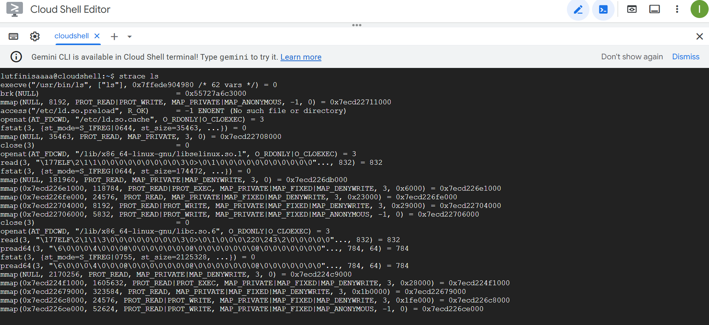
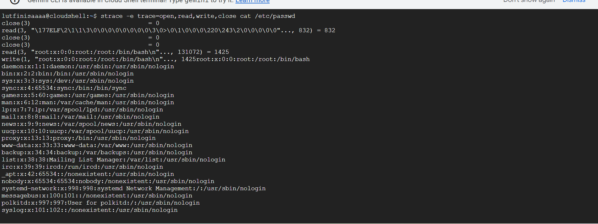
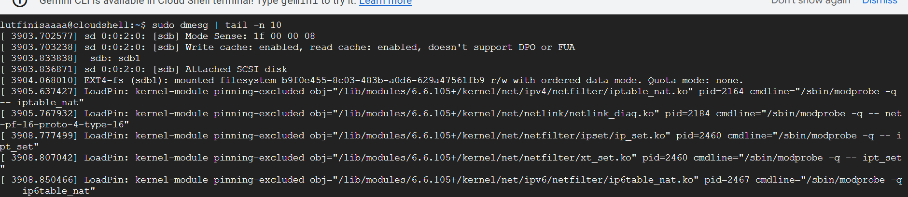

# Laporan Praktikum Minggu [X]
Topik: [Tuliskan judul topik, misalnya "Arsitektur Sistem Operasi dan Kernel"]

---

## Identitas
- **Nama**  : [Lutfi Khoerunnisa]  
- **NIM**   : [250202947]  
- **Kelas** : [1IKRB]

---

## Tujuan
1. Menjelaskan konsep dan fungsi system call dalam sistem operasi.
2. Mengidentifikasi jenis-jenis system call dan fungsinya.
3. Mengamati alur perpindahan mode user ke kernel saat system call terjadi.
4. Menggunakan perintah Linux untuk menampilkan dan menganalisis system call.

---

## Dasar Teori
Tuliskan ringkasan teori (3–5 poin) yang mendasari percobaan.

1. Sistem Operasi (SO): Perantara dan Pengelola Sumber Daya 
SO berfungsi sebagai lapisan perantara antara aplikasi pengguna dan perangkat keras (hardware). Fungsi utamanya adalah mengelola dan mengalokasikan sumber daya sistem secara efisien dan adil, termasuk CPU, memori, dan perangkat I/O. SO menyediakan antarmuka (interface) yang konsisten agar program dapat berjalan tanpa perlu mengetahui detail hardware spesifik.

2. Kernel: Inti Pelaksana Tugas Kritis (Jantung SO) 
Kernel adalah inti (core) sistem operasi, selalu berada di memori. Ia bertanggung jawab untuk menjalankan fungsi-fungsi penting tingkat rendah seperti:
- Penjadwalan Proses (Scheduling): Menentukan proses mana yang akan dijalankan CPU.
- Manajemen Memori: Mengalokasikan ruang memori ke berbagai program.
- Akses Hardware: Mengatur komunikasi dengan perangkat keras melalui driver.

3. Mode Operasi: Pemisahan Keamanan (User vs. Kernel) 
Sistem memisahkan eksekusi ke dalam dua mode untuk keamanan dan stabilitas:
Kernel Mode (Mode Privileged): Mode di mana kernel beroperasi. Memiliki akses penuh dan tak terbatas ke semua hardware dan memori.
User Mode (Mode Terbatas): Mode tempat aplikasi pengguna berjalan. Aksesnya dibatasi; untuk melakukan operasi sensitif (hardware), aplikasi harus meminta layanan kernel melalui System Calls.
---

## Langkah Praktikum
1. Langkah-langkah yang dilakukan.  
2. Perintah yang dijalankan.  
3. File dan kode yang dibuat.  
4. Commit message yang digunakan.

---

## Kode / Perintah
```bash
strace ls
strace -e trace=open,read,write,close cat /etc/passwd
dmesg | tail -n 10

```

---

## Hasil Eksekusi
Sertakan screenshot hasil percobaan atau diagram:




 
# Tabel Observasi Strace ls
| system caal | Keterangan|
|:--- | :---|
| execve | Memuat dan menjalankan program ls itu sendiri.|
|mmap atau munmap | Memetakan atau melepaskan peta file atau perangkat ke dalam memori. Ini sering digunakan oleh pustaka C (glibc) untuk memuat pustaka bersama (shared libraries).|
| openat atau open | Membuka file atau direktori. ls akan menggunakan ini untuk membuka direktori yang akan dicantumkan, dan juga untuk membuka file konfigurasi yang mungkin digunakan. |
| fstat atau newfstatat | Mendapatkan informasi status tentang sebuah file descriptor, seperti ukuran, waktu modifikasi, izin, dll. |
| getdents64 | Membaca entri-entri dalam direktori. Ini adalah panggilan sistem utama yang digunakan ls untuk mendapatkan nama-nama file. | 
| write | Menulis data ke file descriptor. ls menggunakan ini untuk menulis nama-nama file yang ditemukan ke Standard Output (stdout), yang biasanya adalah terminal Anda. |
| close | Menutup file descriptor yang sebelumnya dibuka. | 
| exit_group | Menghentikan proses ls ketika sudah selesai. |

# Tabel Observasi strace -e ... cat /etc/passwd
| system caal | Keterangan|
|:--- | :---|
| strace -e ... cat /etc/passwd | Keluaran akan menunjukkan urutan logis dari empat aksi utama: Membuka, Membaca, Menulis, dan Menutup.|
| open | Ini adalah langkah pertama, di mana program cat meminta kernel untuk membuka file /etc/passwd. |
| read | Setelah file terbuka, cat akan memanggil read secara berulang untuk menarik data dari file /etc/passwd ke dalam buffer-nya. |
 |write | Setelah membaca sepotong data, cat akan segera memanggil write untuk mengirimkan data tersebut ke terminal. |
 | close | Ketika semua data telah dibaca dan ditulis, program cat menginstruksikan kernel untuk melepaskan sumber daya file. | 
 # Tabel Observasi dmesg | tail -n 10
| System call | Keterangan |
|:--- | :---|
| dmesg | Fungsi: Menampilkan semua pesan yang tersimpan di Kernel Ring Buffer. Pesan-pesan ini mencakup informasi tentang inisialisasi hardware (CPU, RAM, disk, USB), pemuatan driver, dan setiap peringatan atau kesalahan yang dihasilkan kernel.Keluaran: Output dmesg bisa sangat panjang, mencakup semua hal sejak sistem terakhir kali dinyalakan. |
| | | Fungsi: Mengambil keluaran (output) dari perintah di sebelah kiri (dmesg) dan menjadikannya masukan (input) untuk perintah di sebelah kanan (tail -n 10). |
| tail -n 10 | Fungsi: Mengambil masukan yang diterima dan hanya menampilkan 10 baris terakhir dari masukan tersebut. | 

## Analisis 400-500 kata ##
System call adalah mekanisme paling krusial yang menjamin keamanan, stabilitas, dan isolasi dalam sebuah OS modern. Mereka bertindak sebagai gerbang kendali tunggal antara program yang berjalan di user space (ruang pengguna) yang tidak tepercaya dengan Kernel (inti OS) yang memiliki hak istimewa (privileged).
1. Model Perlindungan (Isolation)
Konsep inti keamanan OS adalah pemisahan antara user space (mode tanpa hak istimewa, tempat aplikasi berjalan) dan kernel space (mode hak istimewa, tempat OS berjalan).
User Space: Program di sini dibatasi (di-sandboxing). Mereka tidak dapat mengakses hardware secara langsung (seperti disk atau memori proses lain) atau mengubah konfigurasi OS yang vital.
Kernel Space: Kernel adalah satu-satunya entitas yang memiliki akses penuh ke seluruh sumber daya sistem.
Tanpa system call, aplikasi harus memiliki akses langsung ke hardware dan memori, yang akan memungkinkan program jahat (malware) untuk:
Membaca data pribadi dari memori proses lain.
Merusak struktur data kernel, menyebabkan crash atau mengambil alih kendali sistem.
mengubah izin file penting atau menghapus file sistem.

System call memastikan bahwa setiap permintaan penting (misalnya, membuka file, mengirim data lewat jaringan, membuat proses baru) harus melalui prosedur yang diverifikasi dan divalidasi oleh kernel. Hal ini menerapkan prinsip least privilege (hak istimewa paling minimum).
2. Validasi Input dan Kebijakan
Ketika sebuah aplikasi memanggil system call (misalnya, open), kernel tidak langsung menjalankan permintaan tersebut. Sebaliknya, kernel akan:
Validasi Argumen: Memeriksa apakah argumen yang diberikan (misalnya, path file, mode akses) valid.
Pengecekan Izin: Memastikan bahwa pengguna (UID/GID) dan proses yang meminta memiliki hak yang diperlukan untuk melakukan operasi tersebut (misalnya, memeriksa permission bit file).
Jika validasi gagal, kernel akan menolak permintaan tersebut, mengembalikan kode kesalahan (misalnya, Permission Denied), dan mencegah kerentanan keamanan atau penyalahgunaan sumber daya.
Bagaimana OS Memastikan Transisi User–Kernel Berjalan Aman?
Transisi dari user space ke kernel space adalah momen yang paling sensitif, dan harus dilakukan dengan cepat serta aman. Mekanisme ini disebut kernel trap atau interrupt.
1. Mekanisme Transisi (Trap)
OS menjamin keamanan transisi melalui langkah-langkah berikut:
Instruksi Khusus: Program tidak dapat melompat langsung ke kode kernel. Sebaliknya, program harus memicu instruksi CPU khusus (misalnya, syscall atau int 0x80 pada arsitektur lama).
Vector Table: CPU menggunakan Interrupt Descriptor Table (IDT) atau System Call Table untuk memetakan instruksi ini ke titik masuk (entry point) yang telah ditentukan di kernel. Ini memastikan eksekusi selalu dimulai pada kode kernel yang aman, bukan pada kode yang disuntikkan oleh penyerang.
2. Perubahan Konteks dan Mode CPU
Selama transisi yang aman, dua perubahan penting terjadi di CPU:
Perubahan Mode CPU (Ring Level): Level hak istimewa CPU dinaikkan dari Ring 3 (user mode) menjadi Ring 0 (kernel mode). Hanya dalam Ring 0, kernel dapat mengakses instruksi privileged dan seluruh memori sistem.
Pergantian Stack: CPU menyimpan konteks proses pengguna saat ini dan beralih ke Kernel Stack yang terisolasi. Ini mencegah data kernel dicemari oleh data pengguna.

## Quiz
1. [Apa fungsi utama system call dalam sistem operasi?
]  
**Jawaban:Fungsi utama system call adalah sebagai jembatan atau antarmuka antara program aplikasi yang berjalan di ruang pengguna (user mode) dengan kernel sistem operasi untuk meminta layanan atau sumber daya.
2. [Sebutkan 4 kategori system call yang umum digunakan.]  
   **Jawaban:yaitu manajemen proses,manajemen berkas,manajemen perangkat dan komunikasi.
3. [Mengapa system call tidak bisa dipanggil langsung oleh user program?
]  
   **Jawaban: karena program pengguna berjalan di "user mode" , sementara syistem call hanya bisa diakses di "kernel mode"


## Kesimpulan
Strace: Membongkar Ketergantungan Program pada Kernel
Perintah strace secara efektif memperlihatkan blueprint aktivitas program dengan mencatat setiap panggilan sistem yang dilakukannya:
- Siklus Hidup Program (ls): Program ls menunjukkan siklus standar dari sebuah eksekusi: memuat dirinya sendiri (execve), mengelola sumber daya memori dan pustaka (mmap), berinteraksi dengan sistem file untuk mendapatkan daftar file (open/getdents64/fstat), menulis hasilnya ke terminal (write), dan akhirnya menghentikan proses (exit_group). Semua ini adalah fungsi kernel.
- Siklus I/O Sederhana (cat /etc/passwd): Perintah cat (dengan filter -e) mengilustrasikan alur I/O dasar dan terfokus: Membuka file sumber (open), Membaca kontennya ke buffer (read), Menulis konten tersebut ke Standard Output (write), dan Menutup file (close). Ini membuktikan bahwa setiap interaksi data adalah tanggung jawab kernel.

Dmesg: Jendela ke Kesehatan dan Aktivitas Kernel Terbaru
Perintah dmesg | tail -n 10 berfungsi sebagai alat diagnostik cepat untuk status kernel saat ini.
Ia tidak melacak program di ruang pengguna, melainkan mengakses Kernel Ring Buffer—tempat kernel mencatat semua peristiwa tingkat rendah (inisialisasi hardware, pemuatan driver, kesalahan kritis, atau peringatan sistem).

- Penggunaan | tail -n 10 secara spesifik memungkinkan pengguna untuk mengisolasi 10 peristiwa kernel terakhir yang terjadi, menjadikannya alat penting untuk troubleshooting insiden atau mendeteksi hardware yang baru saja tersambung.
Secara keseluruhan, hasil observasi ini menegaskan bahwa kernel adalah jantung sistem Linux yang mengontrol dan memediasi setiap permintaan sumber daya dan komunikasi, baik dari aplikasi yang dieksekusi maupun dari hardware itu sendiri.

---


## Refleksi Diri
Tuliskan secara singkat:
- Apa bagian yang paling menantang minggu ini?  
 bingung pengerjaannya
- Bagaimana cara Anda mengatasinya?  
minta tolong

---

**Credit:**  
_Template laporan praktikum Sistem Operasi (SO-202501) – Universitas Putra Bangsa_
