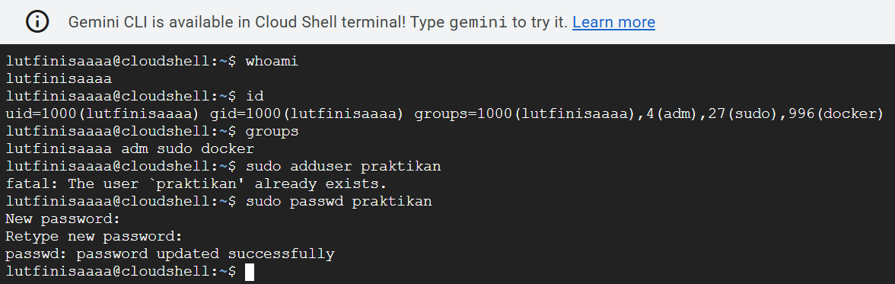

# Laporan Praktikum Minggu [4]
Topik: [Manajemen Proses dan User di Linux]

---

## Identitas
- **Nama**  : [Lutfi Khoerunnisa]  
- **NIM**   : [250202947]  
- **Kelas** : [1IKRB]

---

## Tujuan
Tuliskan tujuan praktikum minggu ini.  
> Menjelaskan konsep proses dan user dalam sistem operasi Linux.
> Menampilkan daftar proses yang sedang berjalan dan statusnya.
> Menggunakan perintah untuk membuat dan mengelola user.
> Menghentikan atau mengontrol proses tertentu menggunakan PID.
> Menjelaskan kaitan antara manajemen user dan keamanan sistem.


---

## Dasar Teori
1. Model Proses (PID & Fork): Setiap program yang berjalan adalah Proses dengan PID unik. Proses baru dibuat secara hierarkis menggunakan fork() (duplikasi induk) dan exec() (memuat program baru), memastikan semua tugas diawasi oleh proses awal (systemd/init).
2. Manajemen Pengguna (UID & GID): Linux adalah sistem multi-user yang memisahkan sumber daya berdasarkan identitas numerik: UID (User ID) untuk pengguna dan GID (Group ID) untuk kelompok. Hal ini menjadi dasar untuk kontrol akses dan keamanan sistem.
3. Hak Akses (rwx): Keamanan file diatur oleh sistem izin, yang menentukan hak baca (r), tulis (w), dan eksekusi (x). Izin ini diterapkan secara terpisah untuk Pemilik, Grup, dan Lainnya, dan dikelola menggunakan perintah chmod dan chown.

---

## Langkah Praktikum
1. melakukan usus buntu
2. mulai melakukan eksperimen 1 yaitu.whoami,id,groups
3. ekeperimen 2,yaitu ps aux | head -10,top -n 1
4. eksperimen 3,yaitu sleep 1000 &,ps aux | grep sleep
5. melakukan screnshoot hasil tersebut
6. mengerjakan tugas,quiz,serta kesimpulan
7. mengupload hasil week ke laporan md

---

## Kode / Perintah
Tuliskan potongan kode atau perintah utama:
```bash
whoami
id
groups
```
```bash
ps aux | head -10
top -n 1
```
```bash
sleep 1000 &
ps aux | grep sleep
kill <PID>
```
```bash
pstree -p | head -20
```
---

## Hasil Eksekusi
Sertakan screenshot hasil percobaan atau diagram:

.png)
.png)
.png)
.png)

---

## Analisis
- Jelaskan setiap output dan fungsinya.
- Jelaskan kolom penting seperti PID, USER, %CPU, %MEM, COMMAND. 
- Jalankan program latar belakang
- Amati hierarki proses dan identifikasi proses induk (init/systemd).

---

## Tugas
1. [Dokumentasikan hasil semua perintah dan jelaskan fungsi tiap perintah.]
   **Jawaban:**
2. [Gambarkan hierarki proses dalam bentuk diagram pohon (pstree) di laporan.]
   **Jawaban: .png)
3. [Jelaskan hubungan antara user management dan keamanan sistem Linux.]
   **Jawaban:Hubungan antara manajemen pengguna (user management) dan keamanan sistem Linux bersifat integral, di mana manajemen pengguna berfungsi sebagai fondasi untuk mengimplementasikan kontrol akses dan akuntabilitas. Dengan menciptakan identitas unik untuk setiap pengguna dan mengelompokkannya (melalui grup), sistem dapat secara ketat menerapkan Prinsip Hak Akses Paling Kecil (PoLP), memastikan setiap orang hanya memiliki izin minimum yang diperlukan, dan secara khusus membatasi penggunaan akun superuser (root) untuk tugas sehari-hari melalui mekanisme seperti sudo. Pengaturan izin file (chmod/chown), otentikasi kata sandi yang kuat, dan pencatatan aktivitas yang terikat pada ID pengguna tertentu memungkinkan administrator untuk mengisolasi sumber daya sistem, melacak semua tindakan, dan merespons pelanggaran keamanan secara efektif.**
4. [Upload laporan ke repositori Git tepat waktu.]
   **Jawaban:**

---

## Quiz
1. [Apa fungsi dari proses init atau systemd dalam sistem Linux?]  
   **Jawaban:Fungsi utama dari proses init (atau penggantinya yang modern, systemd) dalam sistem Linux adalah sebagai proses pertama (PID 1) yang dijalankan oleh kernel. Fungsi ini membuatnya menjadi manajer sistem dan manajer layanan utama yang bertanggung jawab atas inisialisasi, pengawasan, dan penghentian semua proses dan layanan lainnya di sistem.**  
2. [Apa perbedaan antara kill dan killall?]  
   **Jawaban:Perbedaan antara kill dan killall terletak pada cara mereka menargetkan proses di Linux: perintah kill adalah alat yang sangat spesifik dan akurat, karena hanya dapat mengirim sinyal (seperti SIGTERM atau SIGKILL) ke satu atau beberapa Proses ID (PID) tertentu, yang merupakan nomor unik untuk setiap proses yang sedang berjalan. Sebaliknya, perintah killall bersifat massal, karena ia menargetkan dan mengirim sinyal ke semua instans proses yang memiliki nama perintah (process name) yang sama persis, menjadikannya cepat dan praktis untuk menghentikan seluruh aplikasi atau layanan yang memiliki banyak proses anak, namun lebih berisiko jika ada proses lain dengan nama yang serupa.**  
3. [Mengapa user root memiliki hak istimewa di sistem Linux?]  
   **Jawaban:Pengguna root memiliki hak istimewa (privileges) tertinggi di sistem Linux karena mereka adalah Superuser atau administrator sistem yang dirancang untuk memiliki kontrol absolut atas kernel, sistem berkas, dan semua proses yang berjalan.**  
 
---


## Kesimpulan
1. Manajemen Akses Berpusat pada Keamanan (Root & Users) 
Sistem Linux membagi kontrol menjadi hierarki yang ketat: pengguna biasa beroperasi di bawah Prinsip Hak Akses Paling Kecil untuk menjaga keamanan dan akuntabilitas, sementara akun root adalah administrator absolut yang dapat mengabaikan semua izin untuk melakukan tugas-tugas kritis. Praktik modern mendorong penggunaan sudo sebagai pengganti login langsung ke root untuk mengendalikan hak istimewa secara temporer dan tercatat, yang merupakan mekanisme penting untuk mencegah kerusakan sistem dan kompromi keamanan.

2. Systemd sebagai Jantung Operasional (PID 1) 
systemd (atau pendahulunya, init) adalah proses pertama yang dijalankan oleh kernel (PID 1) dan bertindak sebagai manajer sistem utama. Fungsinya mencakup inisialisasi sistem saat booting, pengelolaan perangkat keras, dan yang terpenting, menjalankan, mengawasi, dan mempertahankan semua layanan (daemon) sistem. Keunggulan systemd modern adalah kemampuannya untuk memulai layanan secara paralel, sehingga mempercepat waktu booting, serta menyediakan alat terpadu (systemctl) untuk kontrol.

3. Kontrol Proses yang Tepat atau Massal (kill vs. killall) 
Untuk manajemen proses yang sedang berjalan, sistem menyediakan dua alat utama yang berbeda dalam penargetannya: perintah kill digunakan untuk mengirim sinyal (seperti penghentian normal SIGTERM atau penghentian paksa SIGKILL) ke Proses ID (PID) unik dari satu atau beberapa proses tertentu, memastikan ketepatan. Sebaliknya, killall digunakan untuk mengirim sinyal secara massal ke SEMUA proses yang cocok dengan nama perintahnya, memberikan kemudahan saat menghentikan seluruh aplikasi yang memiliki banyak instans.


## Refleksi Diri
Tuliskan secara singkat:
- Apa bagian yang paling menantang minggu ini?  
 **Menjalankan WSL**
- Bagaimana cara Anda mengatasinya?  
 **Mencoba**

---

**Credit:**  
_Template laporan praktikum Sistem Operasi (SO-202501) – Universitas Putra Bangsa_
