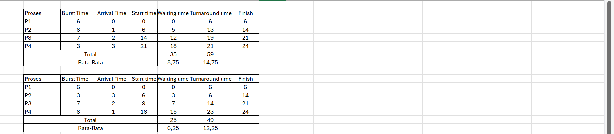
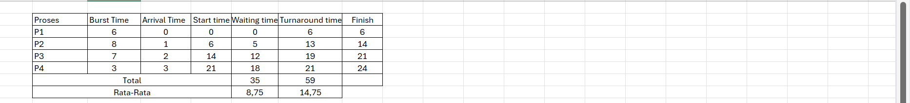

# Laporan Praktikum Minggu [5]
Topik: [Penjadwalan CPU – FCFS dan SJF]

---

## Identitas
- **Nama**  : [Lutfi Khoeruniisa]  
- **NIM**   : [250202947]  
- **Kelas** : [1IKRB]

---

## Tujuan
Tuliskan tujuan praktikum minggu ini.  
> Menghitung waiting time dan turnaround time untuk algoritma FCFS dan SJF.

> Menyajikan hasil perhitungan dalam tabel yang rapi dan mudah dibaca.

> Membandingkan performa FCFS dan SJF berdasarkan hasil analisis.

> Menjelaskan kelebihan dan kekurangan masing-masing algoritma.

> Menyimpulkan kapan algoritma FCFS atau SJF lebih sesuai digunakan.

---

## Dasar Teori
1. FCFS (First-Come, First-Served)
FCFS adalah algoritma penjadwalan non-preemptive yang paling sederhana, di mana CPU diberikan kepada proses yang pertama kali tiba di antrian siap (prinsip FIFO). Meskipun mudah diimplementasikan, kelemahan utamanya adalah rentan terhadap Efek Konvoi (Convoy Effect): jika proses yang sangat lama tiba di awal, semua proses singkat yang datang setelahnya harus menunggu hingga proses lama tersebut selesai, yang secara signifikan meningkatkan waktu tunggu rata-rata sistem.

2. SJF (Shortest Job First)
SJF adalah algoritma penjadwalan yang memilih proses dengan burst time (waktu eksekusi CPU) terkecil berikutnya dari antrian siap, dan dikenal sebagai algoritma optimal karena menghasilkan waktu tunggu rata-rata minimum. SJF dapat diimplementasikan sebagai non-preemptive, atau preemptive (dikenal sebagai SRTF), tetapi masalah utamanya adalah implementasi idealnya sulit karena sistem operasi harus memprediksi atau mengetahui secara akurat berapa lama proses akan berjalan di masa depan.

3. Perbedaan Kunci dan Tujuan Optimal
Perbedaan mendasar antara keduanya terletak pada kriteria pemilihan: FCFS memilih berdasarkan waktu kedatangan untuk memastikan keadilan sequential, sementara SJF memilih berdasarkan durasi burst time untuk mencapai optimasi kinerja (waktu tunggu terpendek). Eksperimen penjadwalan bertujuan membandingkan metrik seperti waktu tunggu, turnaround time, dan throughput untuk menunjukkan bagaimana kebijakan berbasis urutan (FCFS) cenderung menghasilkan kinerja yang lebih buruk dibandingkan kebijakan berbasis prioritas durasi (SJF).

---

## Langkah Praktikum
1. Siapkan data proses dengan menggunakan tabel excel
2. Melakukan eksperimen pertama yaitu Urutkan proses berdasarkan Arrival Time,Hitung nilai berikut untuk tiap proses.Hitung rata-rata Waiting Time dan Turnaround Time.
Buat Gantt Chart sederhana.
3. Melakukan eksperimen kedua mengurutkan proses berdasarkan Burst Time terpendek (dengan memperhatikan waktu kedatangan).Lakukan perhitungan WT dan TAT seperti langkah sebelumnya.
4. Eksperimen ketiga Gunakan Excel/Google Sheets untuk membuat perhitungan otomatis.
5. Screenshot hasil eksperimen dan mengerjakan tugas dan perintah selanjutnya.
6. Upload hasil tepat waktu.

---

## Kode / Perintah
Tuliskan potongan kode atau perintah utama:
```bash
Waiting Time (WT) = waktu mulai eksekusi - Arrival Time
Turnaround Time (TAT) = WT + Burst Time
| P1 | P2 | P3 | P4 |
0    6    14   21   24
```

---

## Hasil Eksekusi
Sertakan screenshot hasil percobaan atau diagram:




---

## Analisis
- Bandingkan hasil rata-rata WT dan TAT antara FCFS & SJF.
  **Algoritma SJF (Shortest Job First) menunjukkan kinerja yang jauh lebih unggul daripada FCFS (First-Come, First-Served), menghasilkan Rata-Rata Waiting Time (6,25) dan Turnaround Time (12,25) yang lebih rendah dibandingkan FCFS (8,75 dan 14,75), membuktikan bahwa SJF optimal dalam meminimalkan waktu tunggu dengan memprioritaskan proses pendek.**
- Jelaskan kondisi kapan SJF lebih unggul dari FCFS dan sebaliknya.
 **SJF lebih unggul ketika tujuannya adalah efisiensi waktu dan terdapat variasi durasi proses. Sebaliknya, FCFS lebih unggul karena kesederhanaan, implementasi yang mudah, dan keadilan mutlak berdasarkan urutan kedatangan, serta jaminan tidak adanya starvation (proses panjang tidak terabaikan).**
- Tambahkan kesimpulan singkat di akhir laporan.
 **Kesimpulan Singkat: Dalam hal efisiensi kinerja yang diukur dari rata-rata waktu tunggu dan penyelesaian, SJF jauh lebih unggul karena kemampuannya meminimalkan waktu eksekusi. Namun, FCFS unggul dalam hal kesederhanaan, keadilan, dan jaminan tidak adanya starvation, menjadikannya algoritma dasar yang andal.**

---
## Quiz
1. [Apa perbedaan utama antara FCFS dan SJF?]  
   **Jawaban:Perbedaan utama antara FCFS (First Come First Served) dan SJF (Shortest Job First) adalah metode penentuan proses mana yang dijalankan terlebih dahulu: FCFS melayani proses berdasarkan urutan kedatangannya, sedangkan SJF melayani proses dengan waktu eksekusi terpendek terlebih dahulu.**  
2. [Mengapa SJF dapat menghasilkan rata-rata waktu tunggu minimum?]  
   **Jawaban:karena pendekatannya yang memprioritaskan eksekusi proses dengan waktu layanan (burst time) terkecil terlebih dahulu.**  
3. [Apa kelemahan SJF jika diterapkan pada sistem interaktif?]  
   **Jawaban:Kelemahan utama SJF pada sistem interaktif adalah waktu tanggap (response time) yang buruk dan ketidakpraktisan implementasi. Sistem interaktif membutuhkan respons cepat, tetapi SJF akan membuat proses interaktif yang singkat harus menunggu hingga proses sebelumnya selesai (terjadi lag). Selain itu, SJF memerlukan prediksi waktu proses yang tidak mungkin diketahui secara akurat di sistem interaktif yang dinamis.**  

---

## Kesimpulan

1. Metode Prioritas Penjadwalan: Perbedaan fundamental antara FCFS (First Come First Served) dan SJF (Shortest Job First) adalah cara mereka menentukan proses mana yang akan dieksekusi terlebih dahulu. FCFS menggunakan prinsip waktu kedatangan, di mana proses yang datang ke antrian lebih awal akan dilayani lebih dulu, menjamin tidak ada proses yang mengalami kelaparan (starvation). Sebaliknya, SJF mengabaikan waktu kedatangan dan memprioritaskan proses berdasarkan waktu layanan (burst time) terkecil, dengan tujuan utama untuk meminimalkan rata-rata waktu tunggu.

2. Kelemahan Kinerja SJF pada Sistem Interaktif: Meskipun SJF secara teoritis efisien untuk mengurangi waktu tunggu rata-rata, algoritma ini menunjukkan kelemahan serius dalam konteks sistem interaktif (seperti antarmuka pengguna). Dalam sistem interaktif, respons cepat sangat penting, namun SJF dapat menyebabkan waktu tanggap (response time) yang buruk karena proses interaktif yang singkat mungkin harus menunggu di belakang proses yang lebih panjang yang telah tiba lebih dahulu, sehingga menciptakan efek "lag" dan menghambat pengalaman pengguna.

3. Kendala Implementasi SJF: Keterbatasan implementasi SJF terletak pada persyaratannya untuk mengetahui waktu eksekusi proses secara pasti di awal. Pada sistem interaktif yang dinamis, waktu eksekusi proses tidak mungkin diketahui secara akurat dan pasti di muka karena sifat interaktif dan variatif dari permintaan pengguna. Persyaratan prediksi waktu ini membuat SJF menjadi algoritma yang tidak praktis (tidak dapat diimplementasikan) di lingkungan sistem operasi modern yang berorientasi pada interaksi pengguna.

---

## Refleksi Diri

Tuliskan secara singkat:
- Apa bagian yang paling menantang minggu ini?  
 **Pembuatan tabel excel**
- Bagaimana cara Anda mengatasinya? 
 **Mencoba** 

---

**Credit:**  
_Template laporan praktikum Sistem Operasi (SO-202501) – Universitas Putra Bangsa_
